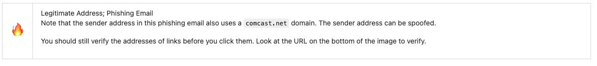

# ZibaSec's Awarness Training (learn.zibasec.com)

This project aims to provide a vetted, open-source body of knowledge around the topic of Security Awareness Training. 

We believe that security awareness training is vital for everyone and that there is a shared interest in spreading the knowledge of cybersecurity awareness with as little friction as possible. Currently, the best content is either gated behind vendors selling you a product (or certification) or scattered throughout random pockets of the internet. This project aims to provide another option that can be used by anyone and improved upon by anyone.

From a single source of content, we're able to provide PDF, HTML, and SCORM content in order to facilitate distribution in the most ways possible. 

## Table Of Contents

<!-- TOC -->

- [ZibaSec's Awarness Training (learn.zibasec.com)](#zibasecs-awarness-training-learnzibaseccom)
  - [Table Of Contents](#table-of-contents)
  - [How to access the content?](#how-to-access-the-content)
  - [How to contribute?](#how-to-contribute)
    - [Container Development Environment](#container-development-environment)
      - [Build dependencies](#build-dependencies)
      - [Building OpenAT Container](#building-openat-container)
      - [Running the OpenAT Container](#running-the-openat-container)
      - [Other Make targets](#other-make-targets)
        - [Cleanup targets](#cleanup-targets)
          - [Targets which should be ran inside the container:](#targets-which-should-be-ran-inside-the-container)
          - [Targets which should be ran *OUTSIDE* the container](#targets-which-should-be-ran-outside-the-container)
    - [How to create a new learning module](#how-to-create-a-new-learning-module)
      - [Create a New Module Folder](#create-a-new-module-folder)
      - [Add Content to Placeholder Files](#add-content-to-placeholder-files)
        - [`index.yml`](#indexyml)
        - [`my-new-module.adoc`](#my-new-moduleadoc)
    - [Learning Module Style Guide](#learning-module-style-guide)
      - [Content Examples](#content-examples)
        - [One line per sentance](#one-line-per-sentance)
        - [Use line breaks for paragraphs](#use-line-breaks-for-paragraphs)
        - [Use AsciiDoc Admonition Blocks](#use-asciidoc-admonition-blocks)
        - [Images go into a folder in each module named `images/`](#images-go-into-a-folder-in-each-module-named-images)
        - [Create a `[.lead]` paragraph](#create-a-lead-paragraph)
      - [Needed Files in a module](#needed-files-in-a-module)
        - [`index.yml` file](#indexyml-file)
        - [One or more asciidoc files](#one-or-more-asciidoc-files)
  - [License](#license)
  - [Get Project Updates](#get-project-updates)

<!-- /TOC -->

## How to access the content?

We publish the latest content (here)[https://learn.zibasec.com/output]. This is the live-running version of the content that is (built and visible on GitHub)[https://github.com/zibasec/awareness-training/tree/master/output].

## How to contribute?

We welcome every class of contribution. Is there content you think could be added, changed, improved, corrected, etc? Then we welcome the feedback via a [GitHub Issues](https://github.com/zibasec/awareness-training/issues) to bring it to the community's attention. For those that wish to contribute deeper, we also welcome pull requests.

### Container Development Environment

To help package the build environment, we are leveraging containerization.

#### Build dependencies

On the machine which will be running this container you need to have the following installed.

* A container build environment (the build script uses one of these in the priority listed below)
** Buildah
** Podman
** Docker
* rsync
* bash
* Python3
* GNU Make

#### Building OpenAT Container

To build and push the container to a registry you have push access to:

```bash
export FULLTAG=ghcr.io/zibasec/awareness-training
bin/buildimage
```

This builds the container locally and pushes a copy to the tag in `${FULLTAG}`.

#### Running the OpenAT Container
The makefile targets which build the courseware need to run *INSIDE* the container's context.

Here's how you start the environment and render the content:

```
export FULLTAG=ghcr.io/zibasec/awareness-training
bin/runenv
[root@73d277417335 source]# make
<lots of output and course is rendered in output/ folder>
```

> If you are running `podman` or `docker` with SELinux enabled, you may need to exit the
> ZOST container and re-run `bin/runenv` to reset SELinux permissions on files you add
> to the working directory after the last time you ran `bin/runenv`.

This will generate all the course material inside of `./output` both inside and outside of the running container.

#### Other Make targets

There are some other `make` targets which help with course development

##### Cleanup targets

###### Targets which should be ran inside the container:

The following targets should be only run inside the container.

`make clean` -- removes all rendered html content

`make nuke` -- removes all rendered html content and the shared files (node modules slideshow css etc)

###### Targets which should be ran *OUTSIDE* the container

The following target should only be run from outside the container (aka before running `bin/runenv`)

`make server` -- starts a web server listening on http://localhost:8000

### How to create a new learning module

To create a new module for this framework follow these steps.

#### Create a New Module Folder

First step is to create a new folder to contain your new module.
This folder should be named after your module using dashes `-` not spaces.

We're also going to create an `images/` folder just in case.
And put some placeholder files in place.

```bash
mkdir -p content/modules/My-New-Module/images
touch content/modules/My-New-Module/images/.gitkeep
touch content/modules/My-New-Module/index.yml
touch content/modules/My-New-Module/my-new-module.adoc
```

#### Add Content to Placeholder Files

##### `index.yml`

The contents of the `index.yml` file should look like this:

```yml
---
module_name: My-New-Module
module_description: "The newest module"
module_version: "v0.0.1"

full_pages:
  - my-new-module.adoc

```

##### `my-new-module.adoc`

The contents of the `my-new-module.adoc` file should look like this:

```asciidoc
---
submodules:
 - submodule_name: My-New-Module
   submodule_description: "New module, the newest"
   submodule_version: "v0.0.1"
   questions: []

---

= New Module
[.lead]
====
This is the lead paragraph for our new module, it sets the expectation for the rest of things.
====

== Sub-header
Sub content
```

### Learning Module Style Guide

#### Content Examples

##### One line per sentance
It makes editiing, source code management and distingusing changes easier if each sentance is on it's own line

For example, don't do this:

```asciidoc
Lorem ipsum dolor sit amet, consectetur adipiscing elit. Metus dictum at tempor commodo ullamcorper a lacus. Ac turpis egestas integer eget aliquet nibh praesent. Porta nibh venenatis cras sed felis eget velit. Amet nisl purus in mollis nunc sed.
```

Instead do this:

```asciidoc
Lorem ipsum dolor sit amet, consectetur adipiscing elit.
Metus dictum at tempor commodo ullamcorper a lacus.
Ac turpis egestas integer eget aliquet nibh praesent.
Porta nibh venenatis cras sed felis eget velit.
Amet nisl purus in mollis nunc sed.
```

##### Use line breaks for paragraphs

When writing multiple paragraphs use a single empty line for the paragraph break

For example:

```asciidoc
Lorem ipsum dolor sit amet, consectetur adipiscing elit.
Metus dictum at tempor commodo ullamcorper a lacus.
Ac turpis egestas integer eget aliquet nibh praesent.
Porta nibh venenatis cras sed felis eget velit.
Amet nisl purus in mollis nunc sed.

Lorem ipsum dolor sit amet, consectetur adipiscing elit.
Metus dictum at tempor commodo ullamcorper a lacus.
Ac turpis egestas integer eget aliquet nibh praesent.
Porta nibh venenatis cras sed felis eget velit.
Amet nisl purus in mollis nunc sed.
```

Multiple empty lines take up space and make the source file harder to read.

##### Use AsciiDoc Admonition Blocks

Long pages of uninterrupted text are hard to read.
Ocassionaly call out important information from the text by using link:https://asciidoctor.org/docs/user-manual/#admonition[AsciiDoc Admonition Blocks]

You should use the block format for admonition blocks, not the paragraph format.

For example:

```asciidoc
[CAUTION]
.Legitimate Address; Phishing Email
====
Note that the sender address in this phishing email also uses a `comcast.net` domain.
The sender address can be spoofed.

You should still verify the addresses of links before you click them.
Look at the URL on the bottom of the image to verify.
====
```

Will render as:



The following are the default admonitions

* NOTE
* TIP
* IMPORTANT
* CAUTION
* WARNING

##### Images go into a folder in each module named `images/`

The Makefile which generates the output expects images to exist under a folder named `images/` inside the module itself.

For example, put an image into `content/modules/Phishing-Examples/images/` and use the following to reference it from the asciidoc file:

```asciidoc
image::images/xfinity-highlight-sender-phish.png[]
```

##### Create a `[.lead]` paragraph

In your module on the first asciidoc file you should create a `[.lead]` paragraph.
This paragraph should have the synopsis of the module.

```asciidoc
<YAML FRONT MATTER>
= A Title of your Module
[.lead]
====
Phishing emails prey upon our lax attention.
Here are some of the tactics used in common phishing email attacks.
====
< the rest of your content >.
```

#### Needed Files in a module

##### `index.yml` file

Each module needs at it's root an `index.yml` file.
This file contains the metadata about the module and references each asciidoc page that makes up the module.

```yml
---
module_name: Phishing Examples
module_description: "Phishing Examples: Email Examples and Ways to Detect Phishing"
module_version: "v1.0.0-rc1"

full_pages:
  - phishing-examples.adoc
```

##### One or more asciidoc files

In the `index.yml` file there is a list of the included asciidoc files using the array `full_pages`.

Each of these files will have a YAML front-matter which includes metadata about the specific submodule.

```yml
---
submodules:
 - submodule_name: Phishing Examples
   submodule_description: "Phishing Examples: Email Examples and Ways to Detect Phishing"
   submodule_version: "v1.0.0-rc1"
   questions:
   - prompt: "Verifying a sender's email address is sufficient."
     type: QUESTION_TYPE_TF
     choices: null
     answer: false
   - prompt: "The big red alert banner on my email client is okay to ignore."
     type: QUESTION_TYPE_TF
     choices: null
     answer: false
   - prompt: "When is it okay to open attachments in email?"
     type: QUESTION_TYPE_CHOICE
     choices:
     - "Always."
     - "Only when from a known contact."
     - "Never"
     - "Only when expected and from a known contact."
     answer: "Only when expected and from a known contact."

---

<the rest of your content>
```

The required fields of this front matter are:

* `submodules` -- this includes an array item that contains the following required fields:
 * `submodule_name` -- self explanitory, the name of the submodule.
 * `subodule_description` -- Text description of the submodule
 * `submodule_version` -- link:https://semver.org/[Semver.org-style] Version number
 * `questions` -- Array of questions to be folded into the SCORM content.
   look at the questions documentation about the format.
   If you don't want to include questions place an empty array: `questions: []`

The top and bottom YAML delimiters (`---`)are required.

## License

All software code is licensed under [Apache Version 2](./LICENSE) and all training content is licensed under [Attribution-ShareAlike 4.0 International (CC BY-SA 4.0)](./LICENSE-CONTENT)


## Get Project Updates

<!-- Begin Mailchimp Signup Form -->
<link href="//cdn-images.mailchimp.com/embedcode/slim-10_7.css" rel="stylesheet" type="text/css">
<style type="text/css">
	#mc_embed_signup{background:#fff; clear:left; font:14px Helvetica,Arial,sans-serif; }
	/* Add your own Mailchimp form style overrides in your site stylesheet or in this style block.
	   We recommend moving this block and the preceding CSS link to the HEAD of your HTML file. */
</style>
<div id="mc_embed_signup">
<form action="https://zibasec.us1.list-manage.com/subscribe/post?u=676f8df1359045273b4000691&amp;id=54c7301553" method="post" id="mc-embedded-subscribe-form" name="mc-embedded-subscribe-form" class="validate" target="_blank" novalidate>
    <div id="mc_embed_signup_scroll">
	<label for="mce-EMAIL">Get Project Updates</label>
	<input type="email" value="" name="EMAIL" class="email" id="mce-EMAIL" placeholder="email address" required>
    <!-- real people should not fill this in and expect good things - do not remove this or risk form bot signups-->
    <div style="position: absolute; left: -5000px;" aria-hidden="true"><input type="text" name="b_676f8df1359045273b4000691_54c7301553" tabindex="-1" value=""></div>
    <div class="clear"><input type="submit" value="Subscribe" name="subscribe" id="mc-embedded-subscribe" class="button"></div>
    </div>
</form>
</div>

<!--End mc_embed_signup-->