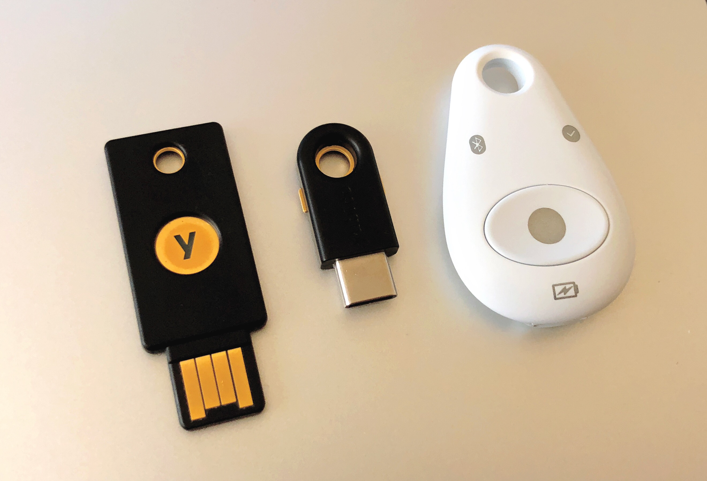

---
submodules:
 - submodule_name: Authentication
   submodule_description: "Authentication: Verifying Your Identity"
   submodule_version: "v0.0.1"
   questions:
   - prompt: "True or False: Usernames and passwords are the most secure way to authenticate?"
     type: QUESTION_TYPE_TF
     choices: null
     answer: false
   - prompt: "If you have to use something you know to authenticate, then passphrases are a good approach?"
     type: QUESTION_TYPE_TF
     choices: null
     answer: true
   - prompt: "Which of the following is the most secure method to authenticate?"
     type: QUESTION_TYPE_CHOICE
     choices:
     - "Something you know (passwords and passphrases)"
     - "Something you are (biometrics)"
     - "Something you have (for example, FIDO2 tokens)"
     - "Using multiple factors."
     answer: "Using multiple factors."

---

= Authentication
[.lead]
====
Authentication is the process of verifying identity.
In the context of users, it is the process of establishing the identity of a person.
There are different ways to accomplish this (some better than others).
Attackers have developed many techniques to attack authentication, and we need to adapt and adopt new approaches to protect our accounts.
====

== Usernames and Passwords
The oldest (and most well-known) approach to digital authentication is the use of usernames and passwords.
Users need to provide their username (usually not considered a secret) and their password (which *should* be considered a secret) to authenticate to a system or service.

The problem with this approach is that humans have difficulty thinking up passwords that are hard for a computer to guess and have a hard time remembering multiple, more secure passwords.
Because of these human weaknesses, passwords are usually easy to guess and reused.
Attackers can take advantage of both of these human weaknesses.
== Brute Force Attacks
Computers enable the automation of menial tasks, and attackers have developed tools and techniques to use computers to attack passwords.
Over time, attackers have built lists of common-used passwords.
They can use computers to try different usernames and password combinations automatically.
Whether they do it against live systems or against hashed (a form of one-way encryption) values taken from a system/service, they are usually successful in cracking at least a small number of accounts with minimal manual effort.

== Credential Stuffing Attacks
Because people have difficulty remembering multiple passwords, they usually cope with this by reusing their credentials.
Once an attacker has cracked a user's account on one system/service, they have a high probability of success by trying the same credentials against other services.
The practice of reusing credentials means that an attacker can compromise multiple accounts through a single account's compromise.

[IMPORTANT]
.IMPORTANT: Mitigating Credential Stuffing Attacks
====
The best way to mitigate a credential stuffing attack is to use unique passwords for every account.

This way, if your online game account password is compromised, your bank account is still secure.
====

== Password Best Practices
To overcome these weaknesses in human-generated and remembered credentials, we recommend the following approaches when using usernames and passwords:

* Use a password manager to remember your passwords (making it easier to use different passwords for each account).
* Use a password manager to generate your passwords.
Generating passwords is another thing computers do better than humans.
* If you have to remember a password, then use a passphrase instead.
  A passphrase is a particular sentence.

[NOTE]
.Password and Passphrase Length
====
The longer a password or passphrase is, the harder it is to brute force.

An example 19 character password: `C35tPQVhCBZ*rV7CVm&`.

An example 9 word passphrase: `Drainage-Auction-Compacted0-Brussels-Floral-Reliant-Handiwork-Yodel-Jogging`.
====

Wikipedia has a link:https://en.wikipedia.org/wiki/List_of_password_managers[list of password managers].

== A Better Way
So far, we've only discussed authentication using 'something we know,' but there are better ways to authenticate.
Using more than one factor or multi-factor authentication (MFA) to authenticate makes an attack that much more difficult for your attacker.

A factor can be any of the following:

* Something you know (like a password or passphrase)
* Something you have (like a key)
* Something you are (biometrics - usually fingerprints)
* Some*where* you are (When's the last time you connected to your account from Russia?)

Note: There may be other factors besides these.

== Something You Have
Most people use keys in their everyday life.
So using keys is something people generally understand.

Physical tokens such as FIDO2 keys (which you usually plug into a USB port) are a good example.

Alternatively, You can install Authentication apps on most phones that can generate one-time codes.
To obtain the code, you must have the device with the app installed and configured.

Some examples of login tokens:

=== RSA SecurID
The RSA SecurID product is a key-fob that provides a one-time passcode (OTP) which, when combined 
with a PIN, becomes the login secret. 
This solution requires that the server and the key-fob keep close sync with their time.

image::images/rsa.jpg[]

=== Universal Two Factor
Another key-fob-based authentication mechanism is to use a Universal Two-Factor (U2F) token.

One such token is a Yubikey.

== Something You Are

Biometrics are usually unique to an individual, therefore, usually an effective form of authentication.
Biometrics data is replicable and challenging, if not impossible, to change, so it is best to combine it with other authentication factors.

== Somewhere You Are

Another less common method of authentication is location.
People tend to establish a physical footprint of places they go.
If there is an attempt to log in from a location far removed from your fingerprint, systems may block or require additional verification before granting access.

== Multi-factor for the Win
Combining multiple factors of authentication before gaining access is the most secure way to safeguard accounts.
Whenever possible, use multi-factor authentication.

As passwords become less complicated to attack, the need to switch to multi-factor authentication will become more urgent.

