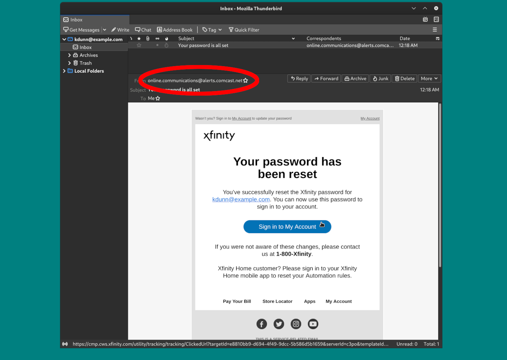
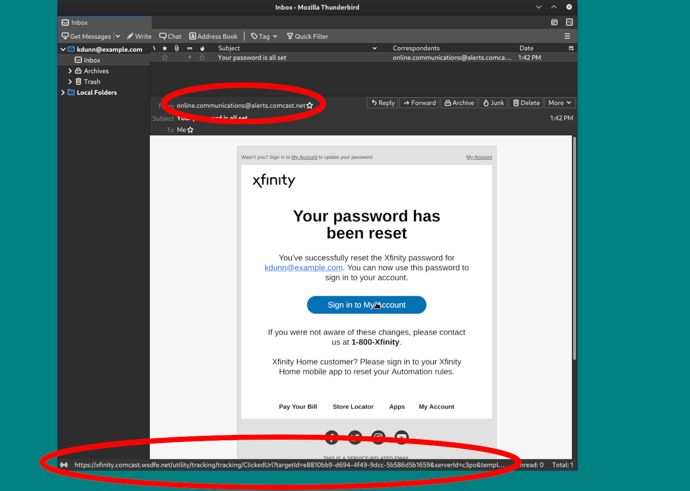
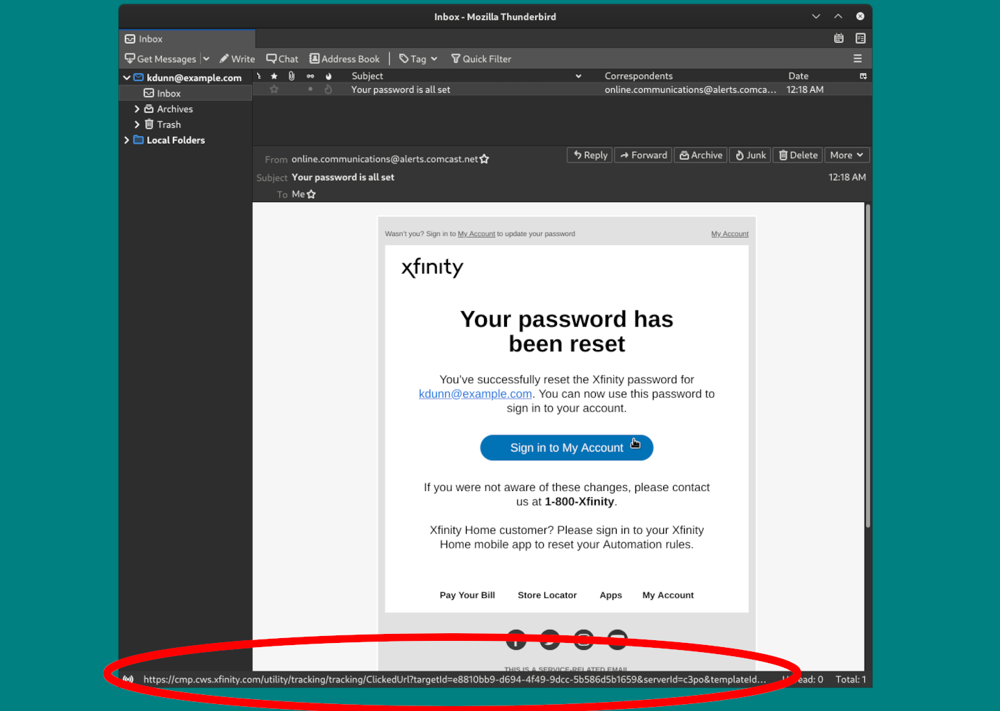
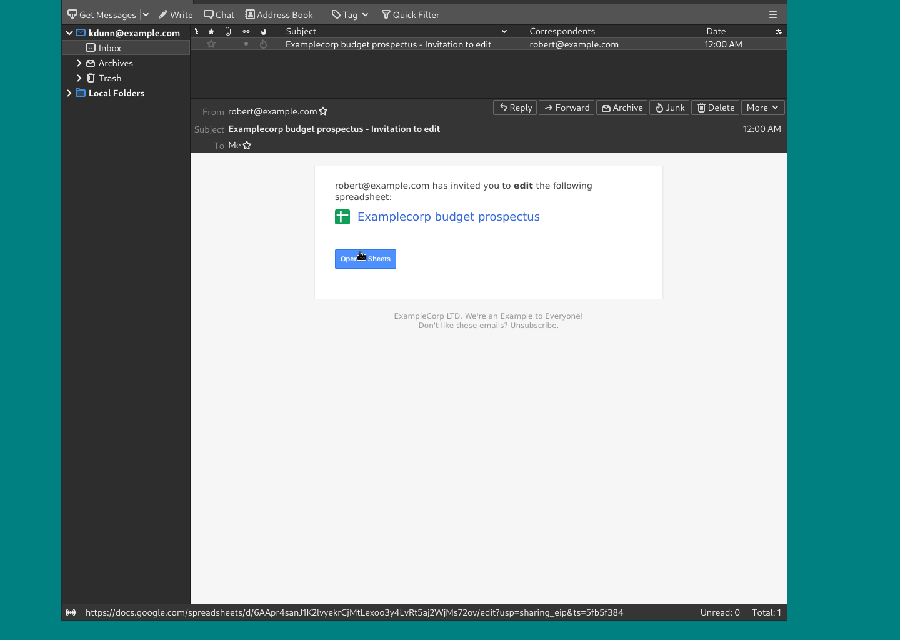
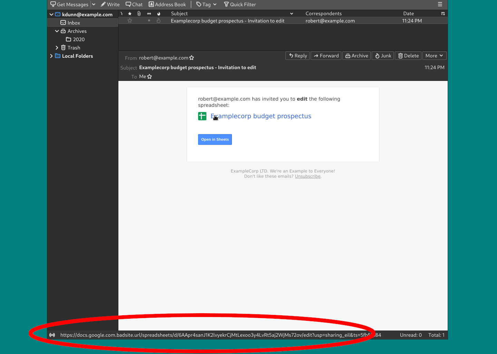
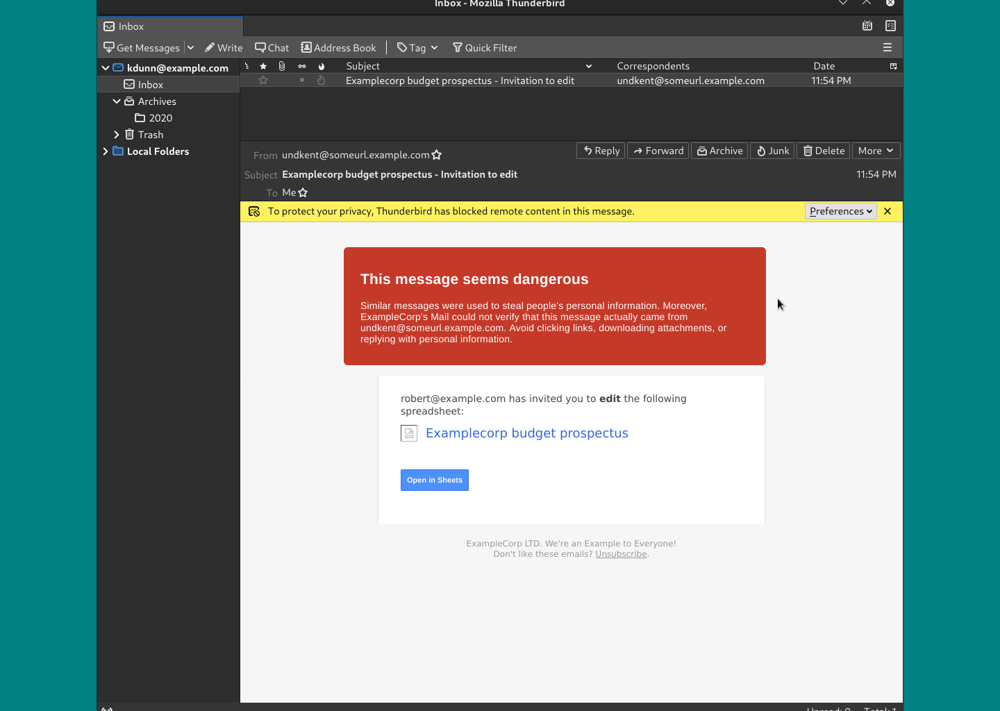
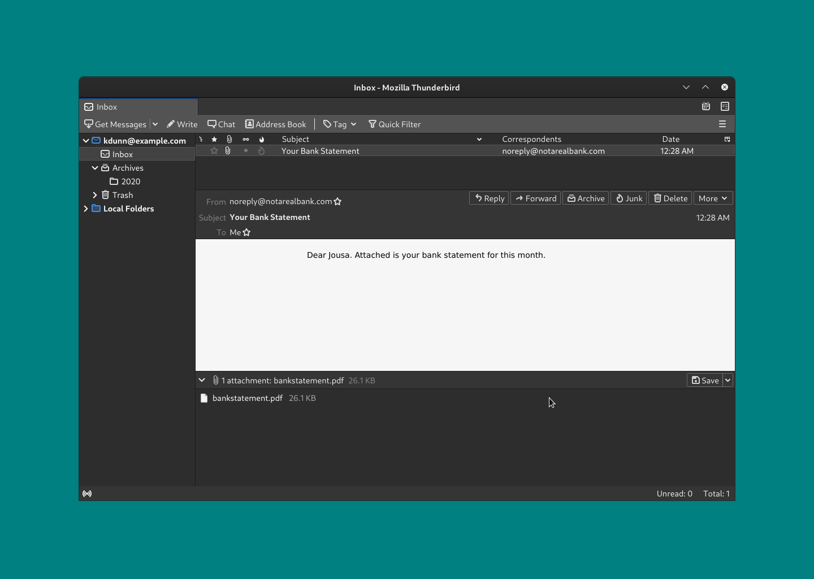

---
submodules:
 - submodule_name: Phishing Examples
   submodule_description: "Phishing Examples: Email Examples and Ways to Detect Phishing."
   submodule_version: "v1.0.0-rc1"
   questions:
   - prompt: "Verifying a sender's email address is sufficient."
     type: QUESTION_TYPE_TF
     choices: null
     answer: false
   - prompt: "The big red alert banner on my email client is okay to ignore."
     type: QUESTION_TYPE_TF
     choices: null
     answer: false
   - prompt: "When is it okay to open attachments in email?"
     type: QUESTION_TYPE_CHOICE
     choices:
     - "Always."
     - "Only when from a known contact."
     - "Never."
     - "Only when expected and from a known contact."
     answer: "Only when expected and from a known contact."

---

= Phishing Email Examples
[.lead]
====
Phishing emails prey upon our lax attention.
Here are some of the tactics used in common phishing email attacks.
====

== Things to Verify

=== Verify sender address
Even though sender email addresses can be spoofed to appear from a legitimate source, you should verify that the sender's address is what you expect.

[NOTE]
.Legitimate Address
====
Note that the sender address in this legitimate email from Comcast/Xfinity has a `comcast.net` domain.
====

[CAUTION]
.Legitimate Address; Phishing Email
====
Note that the sender address in this phishing email also uses a `comcast.net` domain.
It is possible to spoof the sender's address.

You should still verify the addresses of links before you click them.
Look at the URL on the bottom of the image to verify.
====

=== Verify URL Destinations
Phishing emails use links to send you to websites where while they look legitimate, they are not legitimate.

Use your mouse to hover over links or long-press on a touch-based device to show where the link will send you before you click on it.

Attackers hide dangerous links in the following ways:

* Using a "look-alike" domain, `comcast.com.rse2d34s.attacker.url` instead of `comcast.com`, for example
* Using URL shortener to hide URLs.
** Something like `tinyurl.com` or the like.

[NOTE]
.Legitimate Email; Legitimate Link
====
Hover over or long-press the link or button before you press it.

This email has safe links as they point to an `xfinitiy.com` domain.
====

=== Example of a legitimate email from Google Docs

[NOTE]
.Legitimate Email; Google Docs
====
Hover over or long-press the link or button before you press it.

This email has safe links as they point to a `docs.google.com` domain.
====

[CAUTION]
.Phishing Email; Google Docs
====
Compare the above email to this one.

This email does not have safe links as they point to a `badsite.url` domain.
====

=== Trust Your Email Provider and Email Client Warnings

Often you will get warnings either from your email provider or the email client itself.

You should trust those warnings and give any email containing said warnings a thorough vetting.

=== Verify Attachments are Expected
Computer Viruses and malware are often included in attachments.

You should not open an attachment you are not expecting, even if it is from a contact you know and trust.

