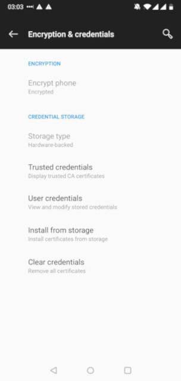

---
submodules:
 - submodule_name: Mobile-Endpoint-Security
   submodule_description: "Mobile Security: Protecting that which goes with you"
   submodule_version: "v0.0.1"
   questions:
   - prompt: "True or False: Attackers  can attack mobile devices through malicious charging stations."
     type: QUESTION_TYPE_TF
     choices: null
     answer: true
   - prompt: "True or False: SMS (or texting) is secure by default and can be trusted."
     type: QUESTION_TYPE_TF
     choices: null
     answer: false
   - prompt: "True or False: If your mobile device battery is unexpectedly drained in a short period of time, it could be compromised."
     type: QUESTION_TYPE_TF
     choices: null
     answer: true
   - prompt: "Which of the following is not something you should do if you suspect your mobile device is compromised?"
     type: QUESTION_TYPE_CHOICE
     choices:
     - "Change/reset the credentials associated with any account that was accessible on the device."
     - "Either get the device securely wiped or inspected by a provider that is capable of assessing the security of the device."
     - "Have the device destroyed and securely disposed of."
     - "Keep using the device normally."
     answer: "Keep using the device normally."

---

= Mobile Security: Protecting that which goes with you
[.lead]
====
Mobile devices (phones, tablets, and other devices) are the ubiquitous objects of modern life.
They present an incredible concentration functionality, but they also present significant security concerns.
Understanding the risks and what you can do to mitigate them will help you make informed decisions about how and when you use mobile devices.
====

== Tracking Devices That Make Phone Calls
About a decade ago, a security expert referred to mobile phones as 'tracking devices that make phone calls.'  The way mobile phone networks have been architected and a principal focus on functionality, mobile phones (and most mobile devices) have de-emphasized privacy and security.

These devices, even if not infected/compromised, leak important data about you.
For example, even if you are not making a phone call, the people who manage the phone network can track your real-time location.
Until recently, any application installed on your device could access the 'clipboard' (where you cut, copy, and paste data temporarily) at any time.
Voice commands are usually processed in the cloud (at the vendor's data centers), which means they likely have access to anything you say in the device's proximity.

Efforts to make them 'just work' mean that when designers chose between privacy/security and usability, the choice was almost always prejudiced towards usability.
Since the link:https://en.wikipedia.org/wiki/Global_surveillance_disclosures_(2013%E2%80%93present)[global surveillance disclosures in 2013], some of the vendors have started to enable privacy/security features without compromising the value proposition that mobile devices present to users.

We will talk about the risks and the things you can do to improve your mobile device usage. Still, if you ever absolutely need a private conversation, it is recommended that you keep the phone/tablet in a different room.

== Being Popular Paints a Target on Your Back
Any system, service, or device that becomes sufficiently popular (and mobile devices certainly qualify), will attract adversaries (both criminal and nation-state) to compromise and exploit them.
Even with the vendors' best efforts, there is still a high probability that a determined adversary will find a way to gain access or subvert it.

Not to say you should give up hope (or throw away your mobile devices), but that you should realize the potential of the hostile environment in which you operate.
Be mindful of the clues we will talk about, and take the measures we recommend, and you can significantly improve the security of your mobile devices.

== Make Sure Your Devices are Encrypted
There is always a chance that your mobile devices might leave your physical control (for example: lost or forgotten).
When that happens, you will want to ensure that the device's data is protected from those who have it in their possession.
Today, most vendors will enable encryption on mobile devices by default.
Still, it is a good idea/practice to verify that this is the case.
Usually, you can go into the device's settings and check/enable this.

For the iPhone, encryption is enabled by default.

== Symptoms of Infection/Compromise
While not always the case, if you notice any of the following signs or symptoms, then you should consider it likely that your device has been compromised:

* Unusual battery consumption/Short battery life
* Unusual or unexpected storage, CPU, or memory usage
* Unusual device behavior or 'slowdown.'
* Unexpected Apps or services installed or running

If you notice any of these (or particularly many of these), you should consider the device possibly compromised.

== What to do if you suspect your device is compromised
To reduce the risks associated with a suspected compromised device, you should do the following:

* Change/reset the credentials associated with any account that was accessible on the device.
* Place the device in 'Airplane mode' (disable network connectivity - Wifi/Cell network access).
* Either get the device securely wiped or inspected by a provider capable of assessing the device's security.
* Depending on your security needs, you might want to have the device destroyed and securely disposed of.

== Mobile Device Management
Suppose you use a mobile device (either personally or organizationally owned) for business. In that case, there is a strong probability that the organization you work for will require that you enroll it in their mobile device management system.

Mobile device management enables the organization to lock, wipe, inspect, update, or selectively delete a mobile device.
Tools like this are a requirement because the organization has an interest (or obligation) to safeguard the data/services that the device can access.
Understand that you will lose a measure of control over the device if it is enrolled in mobile device management.
If you want/need to keep your personal activities private from that organization, then it is recommended that you don't conduct those activities on a managed device.

== Jailbreaking or Rooting a Mobile Device
'Jailbreaking' or 'rooting' a mobile device is disabling some/all of the mobile device security controls.
Jailbreaking is frequently done to install software or configure the device that the default controls would otherwise prevent.

It is essential to realize that you take a significant risk when you do this.
The built-in controls on mobile devices are (at least in part) meant to prevent you from installing potentially malicious software or expose you to other uncontrolled risks.
If you want to do this, recognize that this is not a supported or encouraged action, and you accept additional responsibility for what happens with your device.

Suppose you are curious and want to play with programs/functionality that isn't generally available through official sources. In that case, we recommend that you don't do so with the device you use daily.
In this case, purchase or use another device.

== Physical Security
If a hostile actor gains physical access to your device, then you should probably consider it compromised.
They can implant software/hardware on the device to grant them control or access to the device in the future.
It would be best to physically secure your devices when they are not in your possession (for example: using a safe).

== SMS Security
Many people use short Messaging Service (SMS) to send text messages.
It is important to know that these messages can be read, intercepted, or diverted to/by others.
Like email, this service was initially conceived and designed without concern for how attackers could abuse it, and therefore should not be trusted for sensitive communications.

One application that SMS has been used for is an additional factor for authentication.
Adversaries have learned how to exploit SMS, and using it for multi-factor authentication is not recommended.
Instead, you should use applications built explicitly for this purpose.

Additionally, adversaries have developed tactics and techniques to compromise mobile devices remotely using maliciously formed SMS messages.
It is best to immediately delete (without opening) messages from people you don't know).

== Updates
Most updates are principally security fixes.
Therefore, it is helpful to check for and install updates on your mobile devices frequently.
Sometimes, updating your system is done differently than updating your applications.
Please check both regularly.

== Bluetooth Attacks
Bluetooth enables you to attach or utilize nearby devices wirelessly to extend the functionality of your device.
The problem with Bluetooth is that it can also expose your device to attacks.

One example of an attack is 'Bluesnarfing.'  This attack enables others to gain unauthorized access to information on your device (for example, calendars, contact lists, emails, text messages).
In addition to 'Bluesnarfing', there are other possible attacks that exploit Bluetooth.

Disable Bluetooth on your mobile devices if you don't use it.
Enable it only for the time you need/use it.
Frequently check your mobile devices to see which Bluetooth devices have paired with them.
Remove any/all unexpected devices.

== Juicejacking
Because most mobile devices use their charging interface for additional purposes (for example, sending/receiving data), it is possible to attack a mobile device by operating a malicious charging station.
Only use charging devices that you own and control to charge your mobile devices, including cables and not just charging bricks.
Attackers have successfully created malicious charging cables which can compromise your devices.

== Spyware
Any application installed on your mobile devices has access to a lot of the information available on your device.
Exercise care in selecting what applications (and what permissions you give them) you install on your mobile devices (even from the official application stores.

