---
submodules:
 - submodule_name: Secure-Gmail
   submodule_description: "Securing a gmail.com Email Account"
   submodule_version: "v0.0.1"
   questions: {}

---

= Securing a `gmail.com` Email Account
[.lead]
====
As Gmail is a common Email provider, this module will walk you through some basic security settings you should enable and use on your account.
====

Most of these options and settings exist as part of the Google account.

Click through the settings to "Other Google Account Settings" to find them:

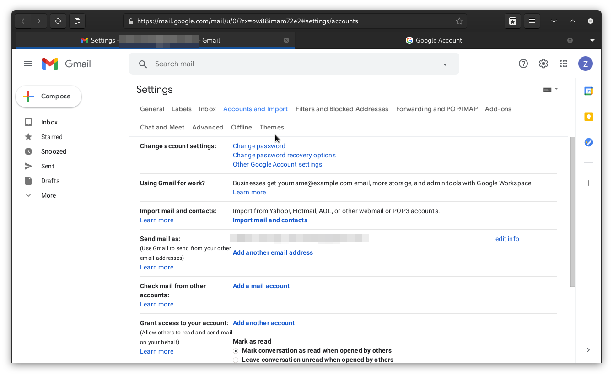

== Choosing a Passphrase
The first step of securing an online account is to have a secure password/passphrase.

A passphrase of multiple words is usually easier to remember and more secure.

Look at the "Authentication" module of this training course for details.

[IMPORTANT]
.IMPORTANT: Use a Password Manager
====
Using a Password Manager is a more secure way to ensure you have the highest security passwords for an account.

Look for more information in the "Password Manager" module of this training.
====

== Associate a Phone Number to the Account
Adding a mobile number to the account gives you one more way to recover or verify your account.

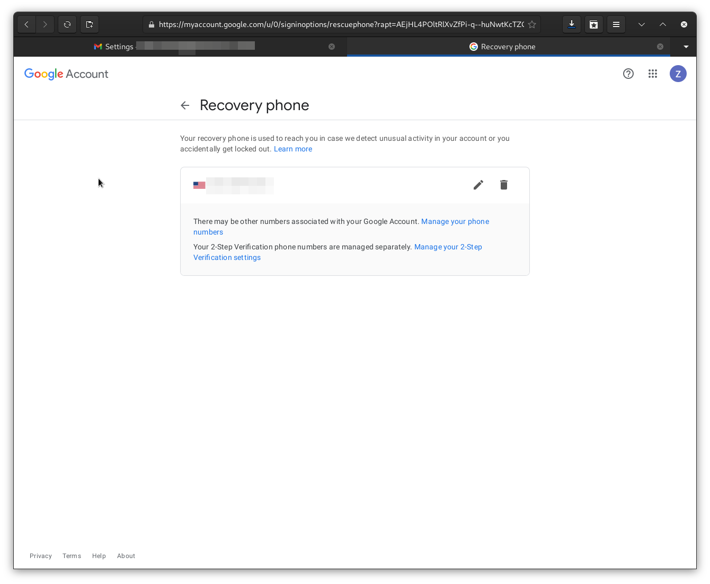

== Setup a Secure Recovery Email Address
One of the security features of a Gmail account is the recovery email address.
Use this address if you are locked out of your account and need to reset the password or verify that you are the account owner.

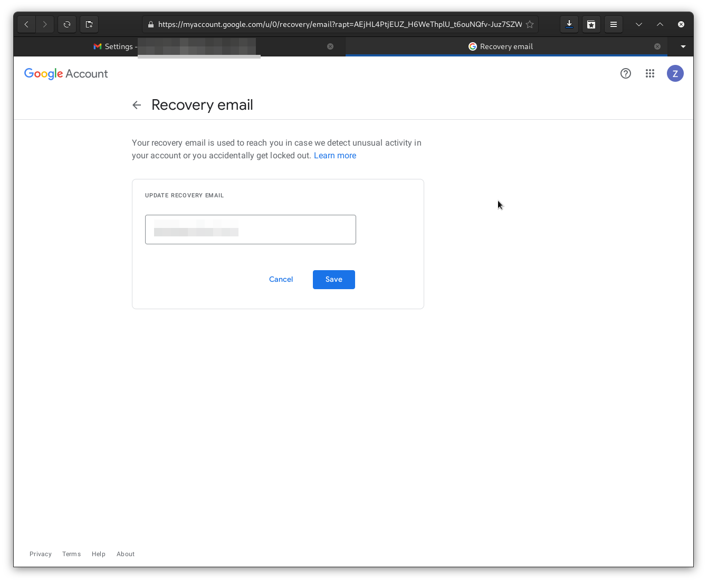
You should choose an address where you have complete trust, as this is essentially a back-door into your Gmail account.

[TIP]
.TIP
====
Use another personal account on a different provider for the highest level of security.
====

== Turn on Multi-Factor Authentication (MFA)
Compromised logins to your accounts are more likely if you don't have Multi-Factor Authentication(MFA) enabled.
It would be best if you turned on MFA on your account.

=== Setup MFA
Start the enrollment of 2-Step (MFA) from the Google Account menu:

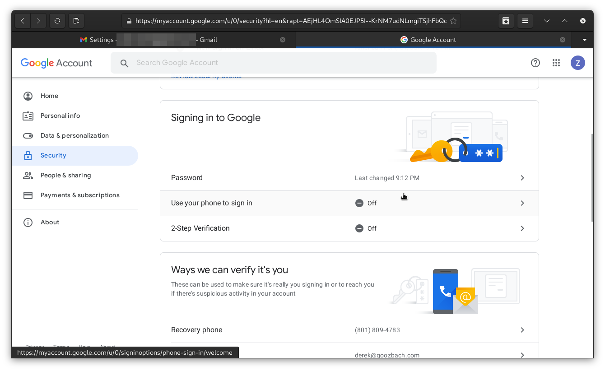

Choose 2-step Verification from the settings menu:

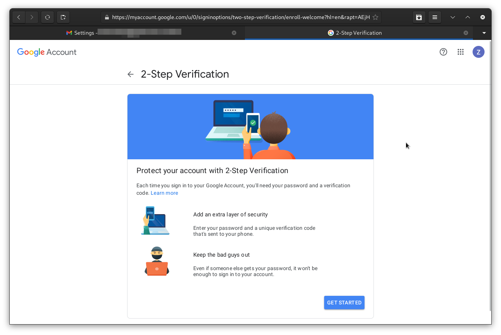

You'll have to choose your phone as the first MFA option:

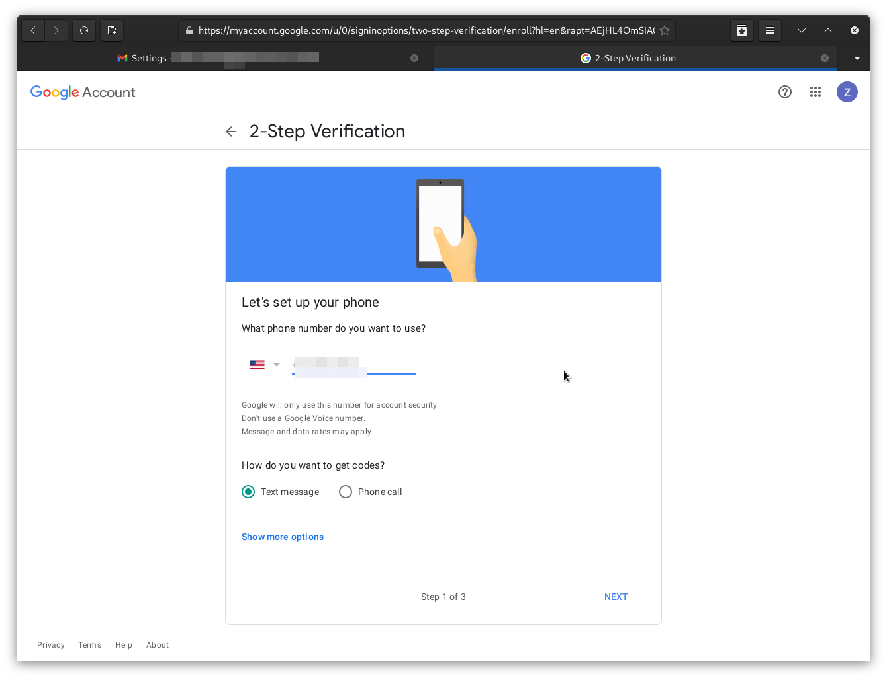

The second step is to verify the code sent to your phone:

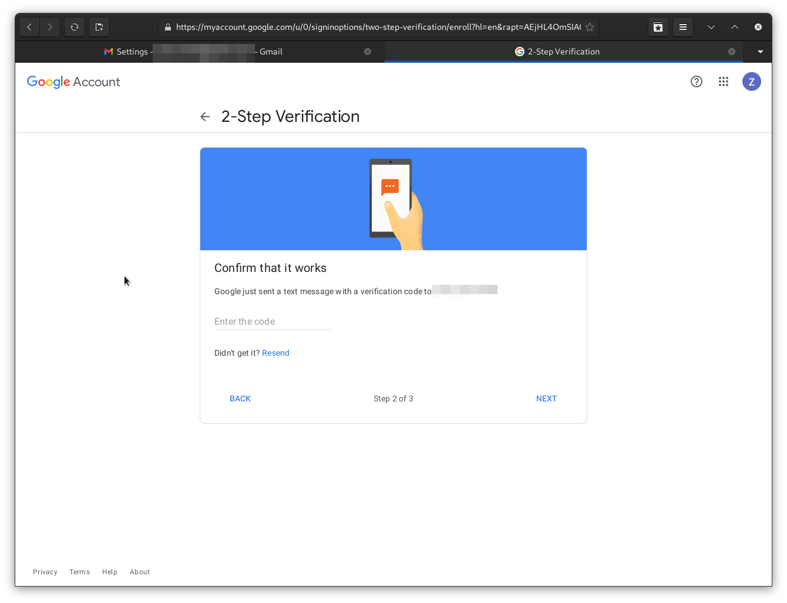

The last step is to complete the MFA enrollment and turn it on for your account:

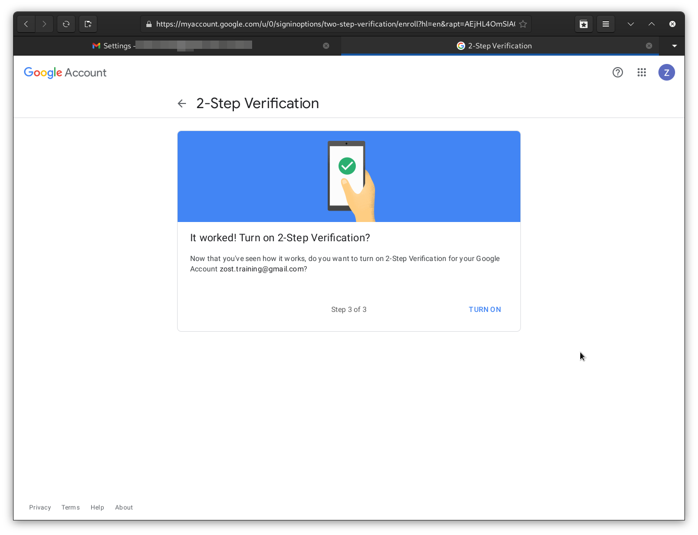

Other options include hardware tokens or a Google Prompt (If you are signed in to Google on your phone):

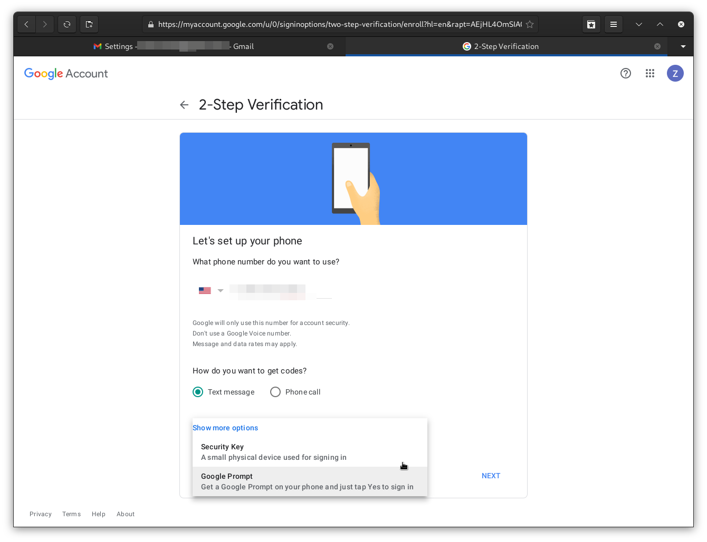

=== Generate Backup Codes
When you turn on 2-step (MFA) on your account, you need a way to access the account if your second factor fails.

The easiest way to do this is to generate some one-time "Backup Codes".

Select "Backup Codes" from the account settings page:

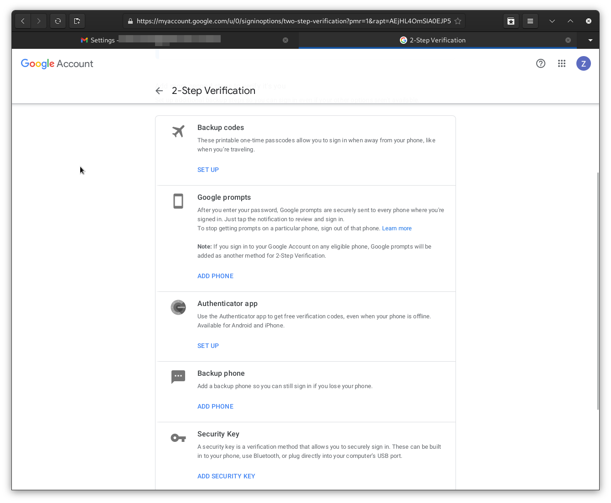

Download, print, or otherwise secure these codes; once you click away, you will have to generate other codes, and these codes will fail to work.

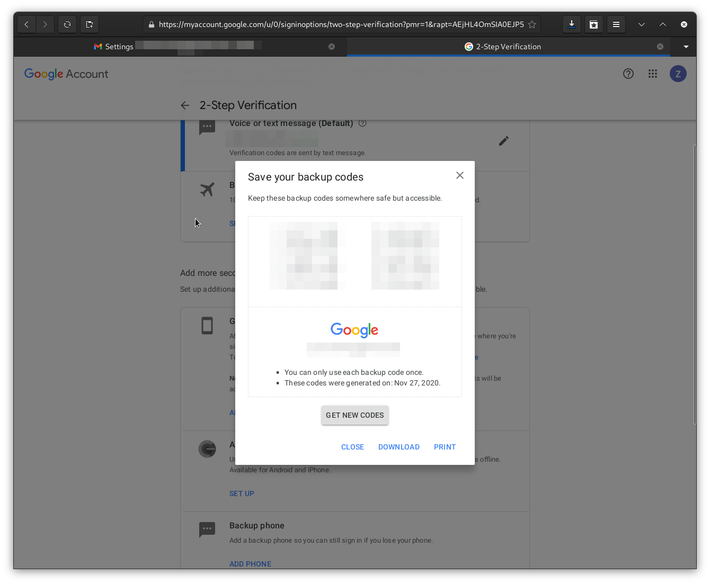

=== Turn Off Less Secure App Access
Your Google account can generate access tokens for less-secure applications.
Unless you need to use one of these applications, it's a good idea to disable such access.

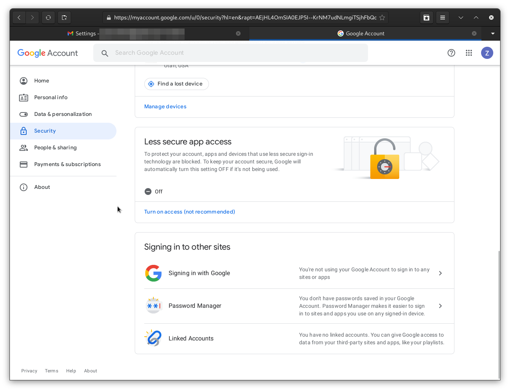

=== (OPTIONAL): Enroll in Google's "Advanced Protection Plan"
If you are a high-value target with a Google account, you can optionally enroll in the Advanced Protection Plan to further secure your account.

Who should enroll in this extended account security plan?

* C-Level executives
* System Administrators
* Public-Facing high-visibility employees
* Anyone who may have high-value information in their email account.

More details can be found link:https://landing.google.com/advancedprotection/[here.]

