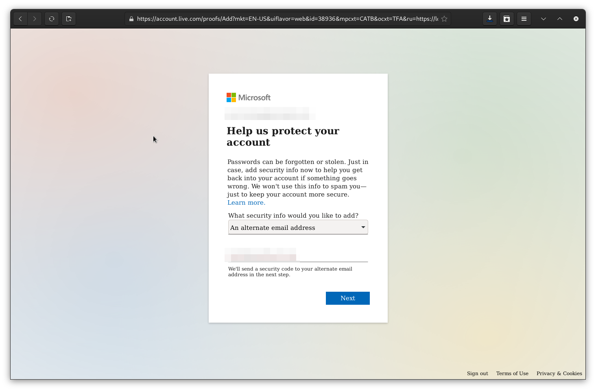
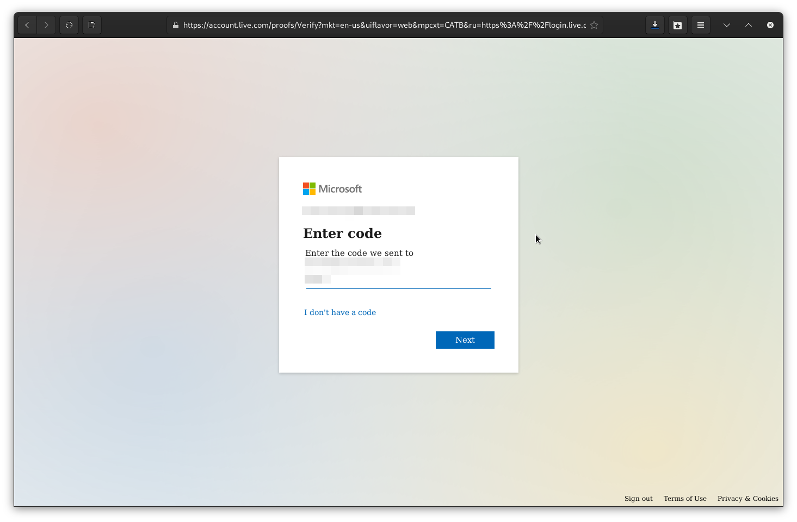
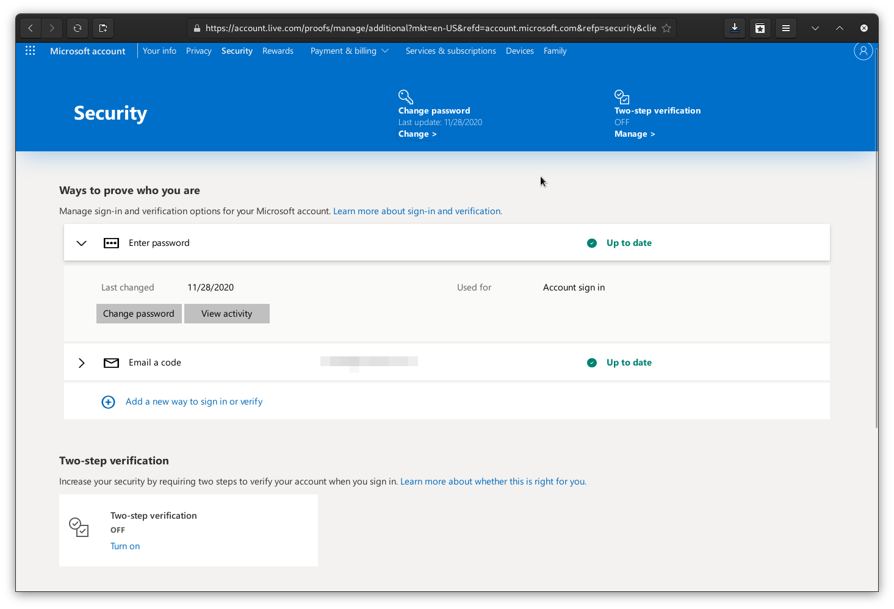
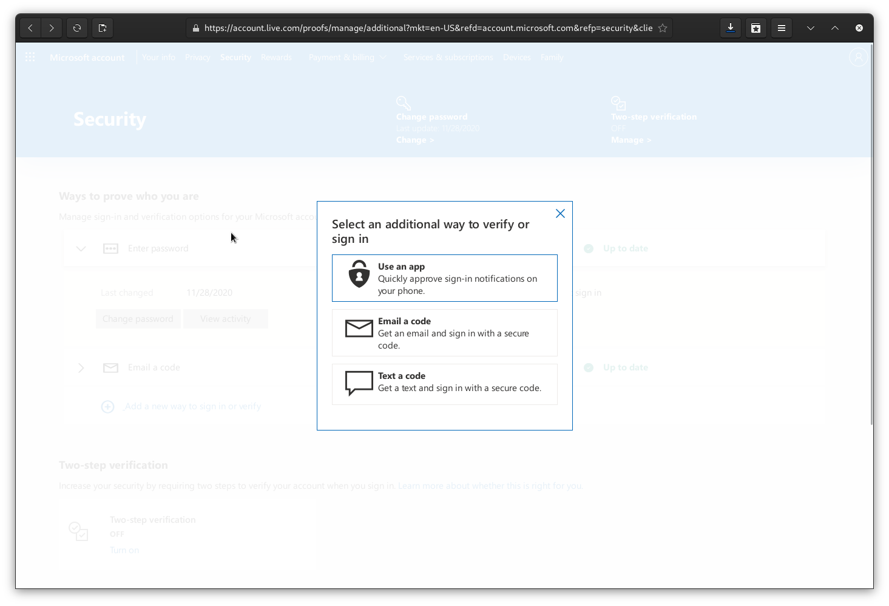
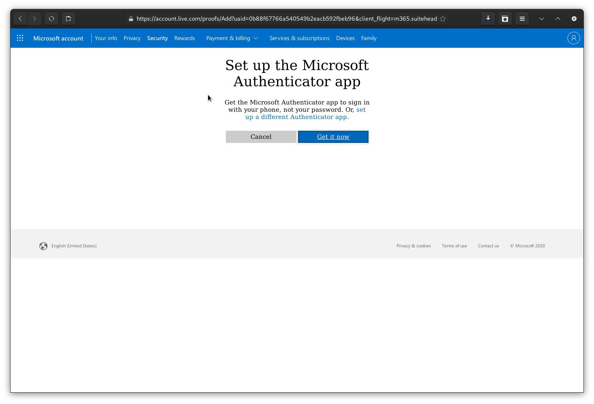
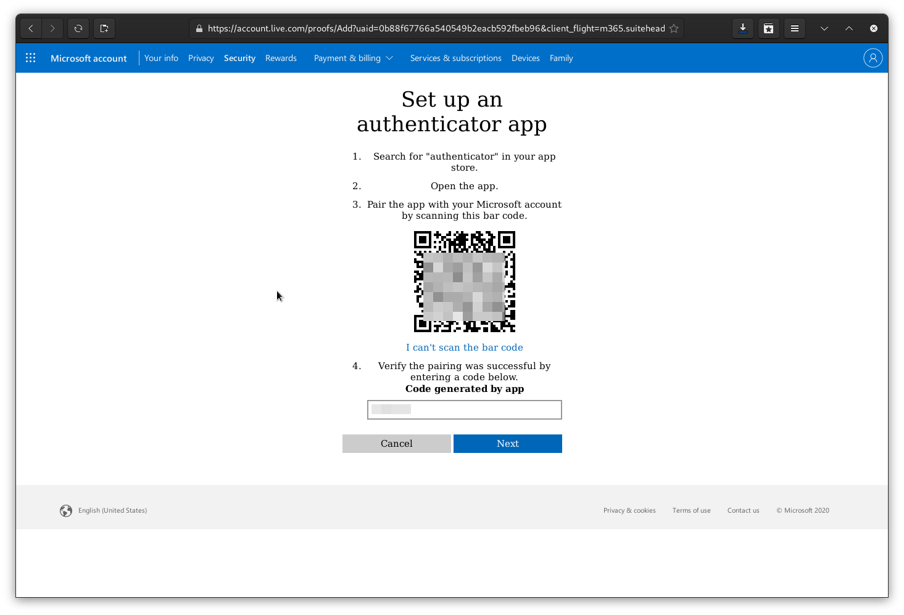
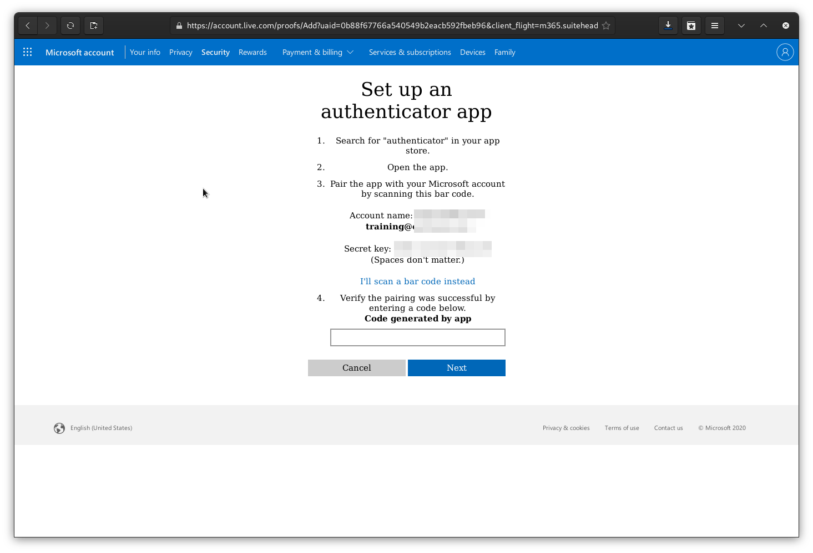
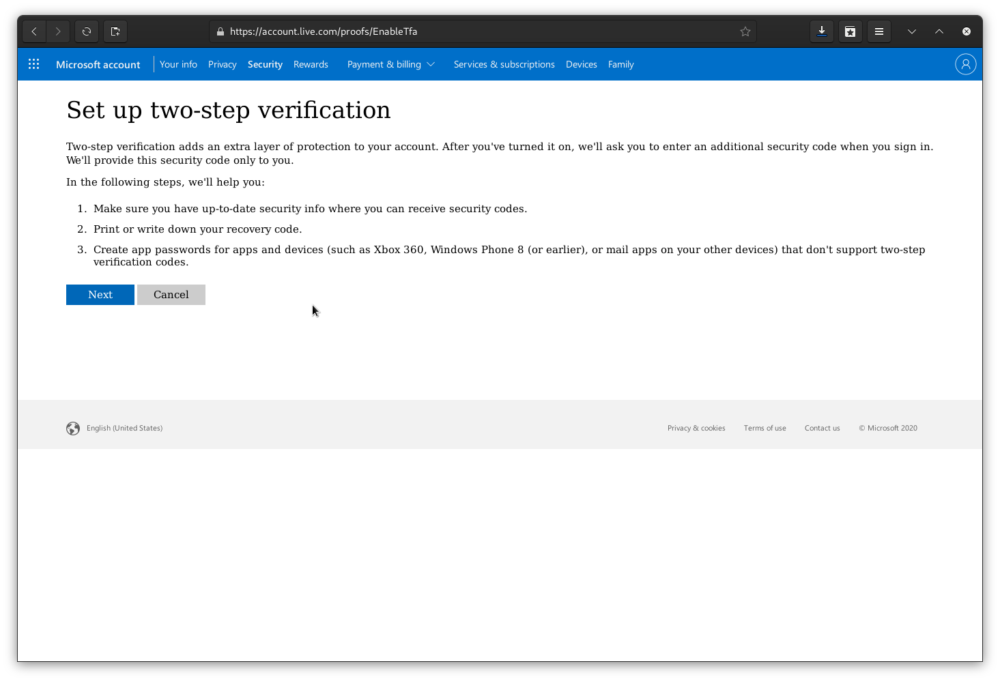
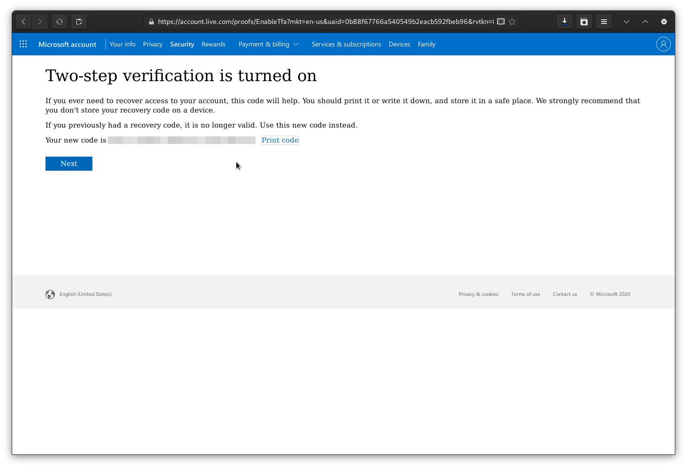
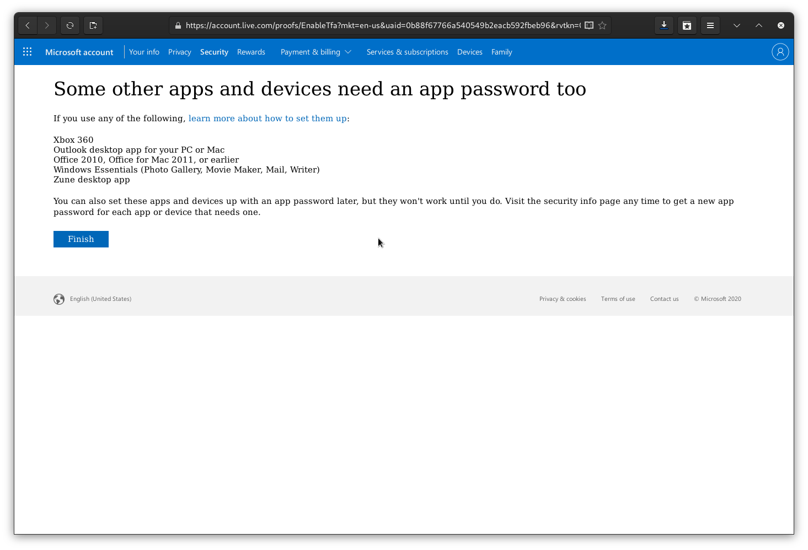

---
submodules:
 - submodule_name: Secure-Microsoft
   submodule_description: "Securing a Microsoft Outlook.com Email Account"
   submodule_version: "v0.0.1"
   questions: {}

---

= Securing a Microsoft `outlook.com` Email Address
[.lead]
====
As Microsoft Live (aka `outlook.com` or `live.com`)  is a common Email provider, this module will walk you through some basic security settings you should enable and use on your account.
====

Most of these options and settings exist as part of the Microsoft `live.com` account.

== Choosing a Passphrase
The first step of securing an online account is to have a secure password/passphrase.

A passphrase of multiple words is usually easier to remember and more secure.

Look at the "Authentication" module of this training course for details.

[IMPORTANT]
.IMPORTANT: Use a Password Manager
====
Using a Password Manager is a more secure way to ensure you have the highest security passwords for an account.

More information about password managers is in the "Password Manager" module of this training.
====

== Setup a Secure Recovery Email Address
One of the security features of a Microsoft account is the recovery email address.
Use this address if you find yourself locked out of your account and need to reset the password or verify that you are the account owner.

The recovery email address will get a code you need to enter:

You should choose an address where you have complete trust, as this is essentially a back-door into your account.

[TIP]
.TIP
====
Use another personal account on a different provider for the highest level of security.
====

== Turn on Multi-Factor Authentication (MFA)
Compromised logins to your accounts are more likely if you don't have Multi-Factor Authentication(MFA) enabled.
It would be best if you turned on MFA on your account.

=== Setup MFA
Start from the advanced security page in the account settings:

Choose "Add a new way to sign in or verify":

Select "Use an app."

You can, at this point, download the Microsoft Authenticator app or click the link labeled "set up a different Authenticator app" to use the TOTP-based app of your choice.

You can, at this point, scan the barcode or click the link "I can't scan the bar code" to get a secret key to insert into your Authenticator app.

Either way, enter the code from the Authenticator app to validate it, and you're on to the next step.

You'll need to turn on the two-step (MFA) verification step manually.

== Generate Recovery Code
When you turn on 2-step (MFA) on your account, you need a way to access the account if your second factor fails.
With your Microsoft account, it creates a recovery code when you enable a second factor.

Download, print, or otherwise secure this code; once you click away, you will have to generate another, and this code will fail to work.

== Microsoft Account additional access methods
Some apps or phones don't do Microsoft account MFA properly and need an app password.

If your app/phone supports MFA properly, do not enable this.

[WARNING]
.Warning: App Passwords
====
Enabling app passwords reduces your account's security.
====

Some applications or systems *REQUIRE* that you create an app password for use with a `live.com` account.

