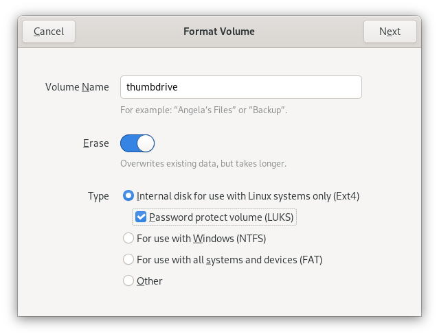
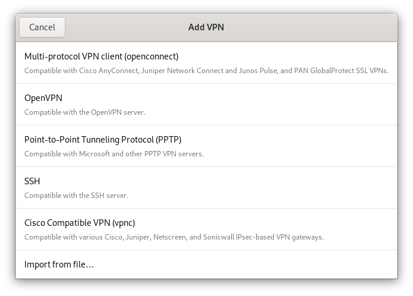

---
submodules:
 - submodule_name: Security-While-Traveling
   submodule_description: "Securing Yourself While Traveling"
   submodule_version: "v0.0.1"
   questions:
   - prompt: "True or False: The costs associated with replacement is not the most significant risk associated with losing a device."
     type: QUESTION_TYPE_TF
     answer: true
   - prompt: "Which of the following is not a measure you can take to secure your mobile devices when traveling abroad?"
     type: QUESTION_TYPE_CHOICE
     choices: 
     - "Using a VPN to protect your network traffic."
     - "Leaving your devices unattended."
     - "Updating them before traveling"
     - "Researching the countries you are traveling to/through"
     - "Seek assistance from your security team."
     answer: "Leaving your devices unattended."
   - prompt: "True or False: You should not be concerned about accessing sensitive data in uncontrolled/insecure operating environments."
     type: QUESTION_TYPE_TF
     answer: true

---

= Securing Your Mobile Computing Experience
[.lead]
====
Mobile computing has become a part of everyday life in the 21st century.
Nearly all of us carry around more computing capacity than NASA used to get a man to the Moon in the 1960s.
We use these devices without giving much conscious thought to the risks associated with them and what measures we can take to protect ourselves.
====

So the two most important questions we need to answer are:

* What could go wrong?
* What can we do to prevent it from happening, or at least minimize the impact?

== Losing Your Device
The first risk we'll discuss is the most obvious scenario; a lost (or stolen) device (almost all of us have lost a mobile device).

While the cost associated with replacing (and setting up) a replacement device is significant, it may be negligible compared with the damage associated with losing control of sensitive information (both work and personal).

What can you do to minimize the risks?

* Check for your devices frequently.
  At least before departing an area and upon arrival at a new area.
  It is better to recognize a device has been lost promptly when you are best positioned to remedy the problem.
* Encrypt your devices.
  If you lose a device, then encrypting it gives you the greatest assurance that those who come into possession of it won't gain access to your sensitive information.
  Devices to be encrypted include external storage devices (thumb drives and hard drives).
* Ensure that the device requires unlocking before accessing it;  a trade-off between security and convenience.
  Use the most secure means to control access to your device that is practicable to you.
  If you know the information is particularly sensitive, then a more secure means of authentication is recommended.
  If possible, use multi-factor authentication.
* If you use your device to support multi-factor authentication, make sure you have alternative means of authenticating if your device is lost.
* Install or utilize device management tools to enable you to wipe the lost device remotely.
  Not always an option, but it can help you sleep at night if it is.

== Uncontrolled/Insecure Operating Environments
You probably don't think too much about the controls in place in your home or office (for example, not just anyone has access to your home).
While you are away from these environments, you are much more exposed.
While not recommended, leaving your laptop unlocked and walking away from it in your home or office poses significantly less risk than doing the same thing at a corner coffee shop.

What can you do to minimize the risks?

* If your device processes or stores sensitive information, you should avoid working in insecure/uncontrolled places.
  If you need to do something in an insecure environment, you should seek out an isolated area, with your back to a wall, and where you can see other people approaching.
* We recommend securing your network traffic with a VPN connection.
  You probably have limited information about the controls of hazards present in an uncontrolled environment; therefore, you should assume that hostile actors are present and sniffing the network traffic.
* Avoid accessing any particularly sensitive information or services while you are in an uncontrolled environment.
  Wait until you are back inside a more controlled environment (if at all possible).

== Traveling Internationally
Taking and using your mobile devices when you travel internationally exposes you to particular hazards.
In many countries, privacy protections (if they exist) are most often weakest at airports.
To gain transit through or gain entry to a country, you probably need to submit to searches of your person and devices.
While most of these searches are perfunctory, other searches can be rather intrusive.
Additionally, some countries have significantly higher criminal activity than your originating country.

What can you do to minimize the risks?

* Research the countries you are traveling to (and through) to understand their privacy protections, security/inspection measures, and criminal activity concerns.
  The last thing you want to do is get surprised along the way.
* Consider minimizing the devices (or the sensitive data) you bring with you.
  If you don't need it for what you intend to do, it is probably best to avoid bringing it with you.
  If you need to use a phone to communicate, but you don't want to risk much of your personal information, then using an alternate phone or wiping your phone may be something you'll want to do.
* Use thin clients (if your organization allows/supports them).
  A thin client doesn't allow/enable storing information on them; therefore, the risk associated with losing or allowing someone to inspect the device is less than with conventional devices.
* Again, using a VPN connection to secure your network traffic.
  It is safe to assume that all traffic is being sniffed by countries and criminal operations while traveling abroad.
  Encrypting all your communications is an essential security measure.
* Whenever possible, do not leave your devices unattended.
  If an adversary has physical access to your devices, they could tamper with them to compromise their security.
  Some attacks are at the hardware-level and are invisible to your system's security measures.
* Seek assistance from your organization's security personnel before traveling.
  They might be able to identify any particular threats and help you mitigate them.
* Update your devices before traveling.
  Two reasons for this.
  First, it makes sure that your devices are protected against any vulnerabilities that its vendors have fixed before your departure.
  Second, it will minimize your need to update while you are using potentially hostile networks.
  Some known attacks leverage software updates to compromise devices.
  While this can be attempted anywhere, updating while traveling makes you particularly vulnerable.

== Summary

While mobile devices have become ubiquitous, they also open us up to significant risks.
Taking the time to prepare and adjust your computing practices can mitigate (if not eliminate) most of these risks.
Encrypting your mobile devices, exercising situational awareness, using a VPN to protect your network traffic, keeping your devices up-to-date are some of the things you can do to protect yourself and your sensitive data.

